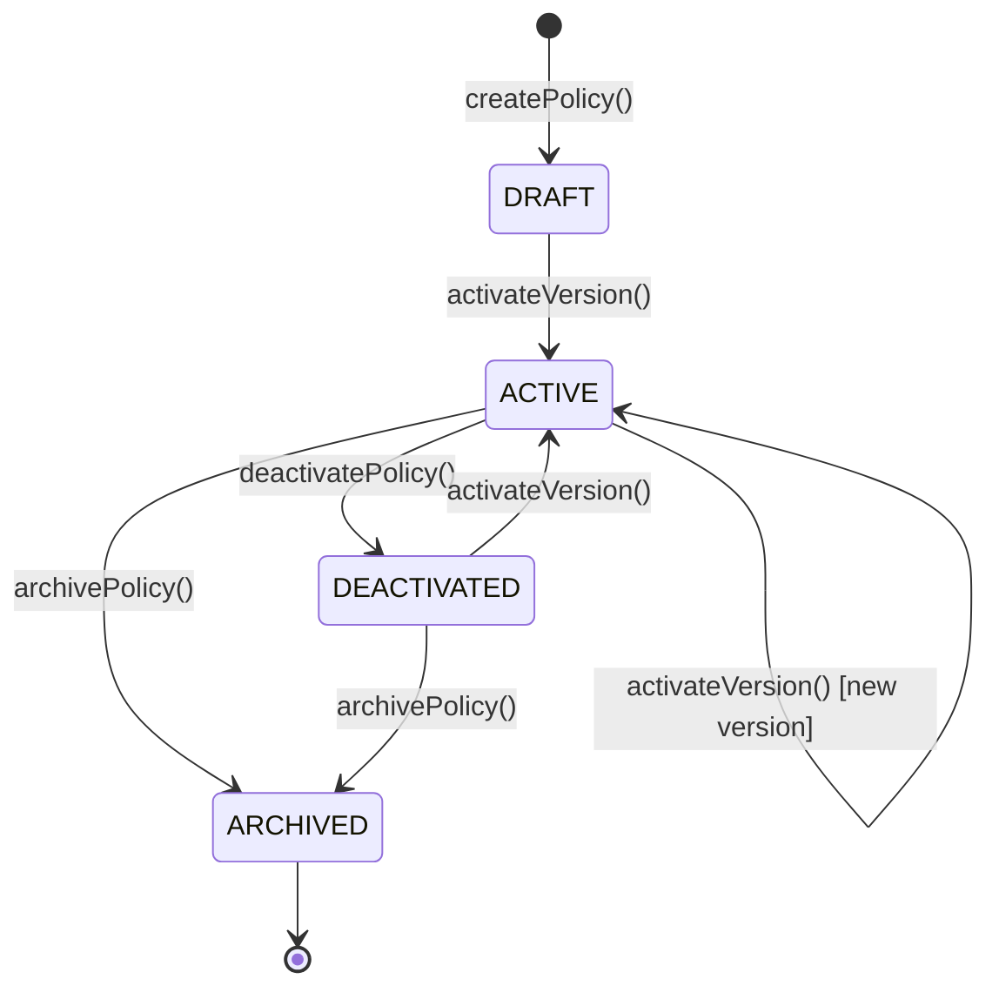

# [ORG-CP-POLICY_DEFINITION-v0.1.0-P1-T01] Design State Machine Model

**Issue:** #94
**Phase:** 1 - Design
**Agent:** webwakaagent3 (Architecture & System Design)
**Execution Date:** 2026-02-26

---

## 1. Policy Lifecycle States

| State | Description |
|-------|-------------|
| DRAFT | Policy created but no version activated yet |
| ACTIVE | Policy has an active version available for evaluation |
| DEACTIVATED | Policy explicitly deactivated; cannot be evaluated |
| ARCHIVED | Policy permanently archived; immutable |

## 2. State Transitions

| # | From | To | Trigger | Guard |
|---|------|----|---------|-------|
| 1 | (none) | DRAFT | createPolicy() | policy_name unique, rules valid |
| 2 | DRAFT | ACTIVE | activateVersion() | version exists |
| 3 | ACTIVE | ACTIVE | activateVersion() | new version exists |
| 4 | ACTIVE | DEACTIVATED | deactivatePolicy() | requesting_context authorized |
| 5 | DEACTIVATED | ACTIVE | activateVersion() | version exists |
| 6 | ACTIVE | ARCHIVED | archivePolicy() | requesting_context authorized |
| 7 | DEACTIVATED | ARCHIVED | archivePolicy() | requesting_context authorized |

## 3. Policy Version States

| State | Description |
|-------|-------------|
| CREATED | Version created and persisted |
| ACTIVE | Version is the current active version for evaluation |
| SUPERSEDED | Version replaced by a newer active version |

## 4. Terminal States

- **ARCHIVED** is the only terminal state for policies
- **SUPERSEDED** is terminal for individual versions (cannot be re-activated in v0.1.0)

## 5. State Diagram (Mermaid)

**Unblocks:** #95

---

*Executed by webwakaagent3 under the WebWaka Autonomous Platform Construction System.*
