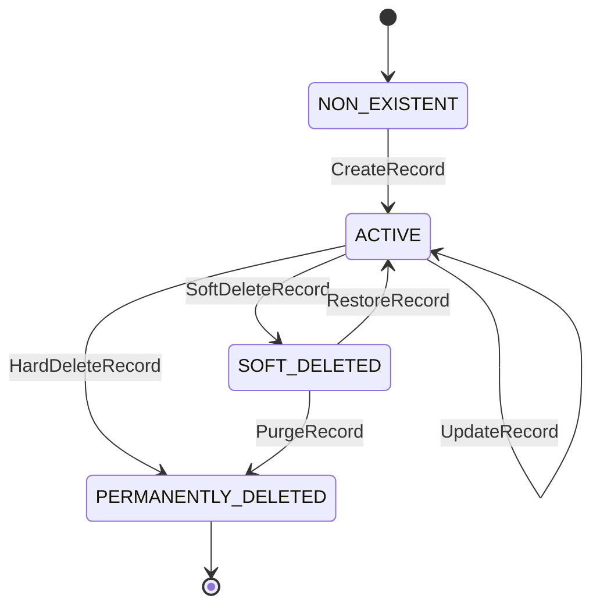

# [ORG-DP-RECORD_STORE-v0.1.0-P1-T01] Design State Machine Model

**Issue:** #65
**Phase:** 1 — Design
**Agent:** webwakaagent3 (Architecture & System Design)
**Execution Date:** 2026-02-26

---

## 1. Record Lifecycle State Machine

### 1.1. States

| State | Description | Terminal |
|-------|-------------|---------|
| `NON_EXISTENT` | Record does not exist in any collection | NO (initial) |
| `ACTIVE` | Record exists and is available for read/write operations | NO |
| `SOFT_DELETED` | Record is logically deleted but physically retained | NO |
| `PERMANENTLY_DELETED` | Record has been physically removed; state is terminal | YES |

### 1.2. Transitions

| From | To | Trigger | Guard Conditions |
|------|----|---------|-----------------|
| `NON_EXISTENT` | `ACTIVE` | `CreateRecord` | collection exists, record_id unique in collection, data non-null, schema valid (if declared) |
| `ACTIVE` | `ACTIVE` | `UpdateRecord` | expected_version == current_version, data non-null, schema valid |
| `ACTIVE` | `SOFT_DELETED` | `SoftDeleteRecord` | expected_version == current_version |
| `ACTIVE` | `PERMANENTLY_DELETED` | `HardDeleteRecord` | expected_version == current_version |
| `SOFT_DELETED` | `ACTIVE` | `RestoreRecord` | expected_version == current_version |
| `SOFT_DELETED` | `PERMANENTLY_DELETED` | `PurgeRecord` | expected_version == current_version |

### 1.3. Forbidden Transitions

| From | To | Reason |
|------|----|--------|
| `ACTIVE` | `NON_EXISTENT` | Records cannot revert to non-existent |
| `SOFT_DELETED` | `NON_EXISTENT` | Soft-deleted records cannot revert |
| `PERMANENTLY_DELETED` | Any | Terminal state; no outbound transitions |
| `NON_EXISTENT` | `SOFT_DELETED` | Cannot soft-delete a non-existent record |
| `NON_EXISTENT` | `PERMANENTLY_DELETED` | Cannot delete a non-existent record |

### 1.4. State Diagram (Mermaid)

---

## 2. Collection Lifecycle State Machine

### 2.1. States

| State | Description | Terminal |
|-------|-------------|---------|
| `NON_EXISTENT` | Collection does not exist | NO (initial) |
| `ACTIVE` | Collection exists and accepts records | NO |
| `ARCHIVED` | Collection is read-only; no new records accepted | NO |

### 2.2. Transitions

| From | To | Trigger | Guard Conditions |
|------|----|---------|-----------------|
| `NON_EXISTENT` | `ACTIVE` | `CreateCollection` | collection_name valid and unique |
| `ACTIVE` | `ARCHIVED` | `ArchiveCollection` | requesting_context provided |
| `ARCHIVED` | `ACTIVE` | `UnarchiveCollection` | requesting_context provided |

---

## 3. Version Monotonicity Model

| Operation | Version Effect |
|-----------|---------------|
| `CreateRecord` | version = 1 |
| `UpdateRecord` | version = previous_version + 1 |
| `SoftDeleteRecord` | version = previous_version + 1 |
| `RestoreRecord` | version = previous_version + 1 |
| `HardDeleteRecord` | version frozen at final value |
| `PurgeRecord` | version frozen at final value |

### Concurrency Guard

Every mutation operation requires `expected_version` matching the current `version`. If `expected_version != current_version`, the operation fails with `CONCURRENT_MODIFICATION_CONFLICT`.

---

## 4. Event Emission Model

Events are emitted **after** successful state transition and storage commit:

| Transition | Event |
|-----------|-------|
| NON_EXISTENT → ACTIVE | `RecordCreatedEvent` |
| ACTIVE → ACTIVE | `RecordUpdatedEvent` |
| ACTIVE → SOFT_DELETED | `RecordDeletedEvent (soft=true)` |
| ACTIVE → PERMANENTLY_DELETED | `RecordDeletedEvent (soft=false)` |
| SOFT_DELETED → ACTIVE | `RecordRestoredEvent` |
| SOFT_DELETED → PERMANENTLY_DELETED | `RecordPurgedEvent` |

**Invariant:** No event is emitted if the storage commit fails.

**Unblocks:** #66

---

*Executed by webwakaagent3 under the WebWaka Autonomous Platform Construction System.*
