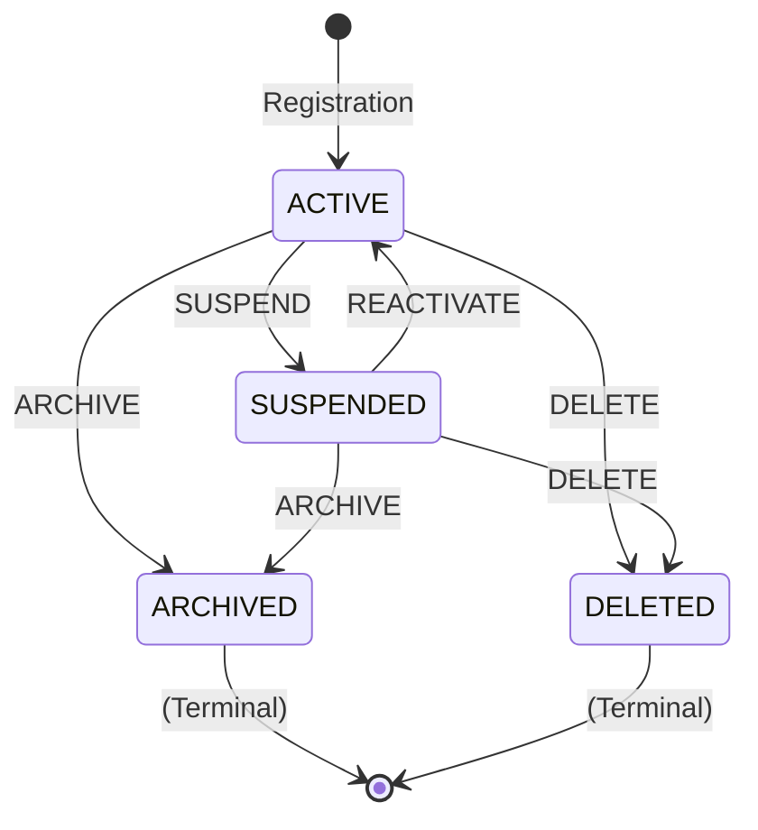

# [ORG-IA-SUBJECT_REGISTRY-v0.1.0-P1-T01] Design State Machine Model

**Structure:** `ORG-IA-SUBJECT_REGISTRY-v0.1.0`
**Layer:** Organelle
**Category:** Identity & Access (01)
**Issue:** #7
**Parent Issue:** #6 (Phase 1: Design)
**Master Issue:** #1 (Subject Registry Organelle — Master Implementation Issue)
**Repository:** WebWakaHub/webwaka-organelle-universe
**Type:** design
**Execution Date:** 2026-02-26
**Executing Agent:** webwakaagent3 (Architecture & System Design Department)
**Acting Under Canonical Role:** Architecture & System Design
**Protocol:** WebWaka Autonomous Platform Construction System

---

## 1. Overview

This document provides the formal design of the **Subject Lifecycle State Machine** for the Subject Registry Organelle. The state machine governs all valid lifecycle transitions for subject records and enforces the behavioral invariants declared in the Phase 0 specification (INV-SR-008, INV-SR-009, INV-SR-010).

The state machine is deterministic, finite, and has exactly two terminal (absorbing) states. It is designed to be technology-agnostic and implementable in any runtime environment.

---

## 2. State Definitions

The Subject Lifecycle State Machine has exactly **four states**, each with a well-defined semantic meaning:

| State | Code | Terminal | Description |
|-------|------|----------|-------------|
| **Active** | `ACTIVE` | No | The subject is operational and can participate in platform activities. This is the initial state assigned at registration. |
| **Suspended** | `SUSPENDED` | No | The subject is temporarily disabled. It cannot participate in platform activities but can be reactivated. Suspension is reversible. |
| **Archived** | `ARCHIVED` | Yes | The subject is permanently archived. The record is retained for audit and compliance purposes but is read-only. No further state transitions are permitted. |
| **Deleted** | `DELETED` | Yes | The subject is permanently marked for deletion (soft delete). The record may be retained for a configurable retention period before physical removal. No further state transitions are permitted. |

### 2.1. Initial State

The initial state for all newly registered subjects is **`ACTIVE`**. There is no explicit "pending" or "unverified" state at the organelle layer. Higher layers (Cell, Tissue) may implement additional pre-activation workflows if needed.

### 2.2. Terminal States

`ARCHIVED` and `DELETED` are **terminal (absorbing) states**. Once a subject enters either state, no further transitions are permitted. This enforces invariant INV-SR-009 (Terminal State Irreversibility).

---

## 3. Transition Table

The following table defines all valid state transitions. Any transition not listed here is **invalid** and must be rejected.

| From State | To State | Transition Name | Guard Condition | Event Emitted |
|------------|----------|-----------------|-----------------|---------------|
| `ACTIVE` | `SUSPENDED` | `SUSPEND` | Subject must be in `ACTIVE` state; `expected_version` must match | `SubjectStatusChangedEvent` |
| `ACTIVE` | `ARCHIVED` | `ARCHIVE` | Subject must be in `ACTIVE` state; `expected_version` must match | `SubjectStatusChangedEvent`, `SubjectArchivedEvent` |
| `ACTIVE` | `DELETED` | `DELETE` | Subject must be in `ACTIVE` state; `expected_version` must match | `SubjectStatusChangedEvent`, `SubjectDeletedEvent` |
| `SUSPENDED` | `ACTIVE` | `REACTIVATE` | Subject must be in `SUSPENDED` state; `expected_version` must match | `SubjectStatusChangedEvent` |
| `SUSPENDED` | `ARCHIVED` | `ARCHIVE` | Subject must be in `SUSPENDED` state; `expected_version` must match | `SubjectStatusChangedEvent`, `SubjectArchivedEvent` |
| `SUSPENDED` | `DELETED` | `DELETE` | Subject must be in `SUSPENDED` state; `expected_version` must match | `SubjectStatusChangedEvent`, `SubjectDeletedEvent` |

**Total valid transitions:** 6
**Invalid transitions (rejected):** All others, including any transition from `ARCHIVED` or `DELETED`.

---

## 4. State Machine Diagram

```
                    ┌─────────────────────────────────────────┐
                    │           SUBJECT LIFECYCLE              │
                    │           STATE MACHINE                  │
                    └─────────────────────────────────────────┘

                              ┌──────────┐
                    ┌────────►│ ARCHIVED │ (Terminal)
                    │         └──────────┘
                    │ ARCHIVE       ▲
                    │               │ ARCHIVE
     ┌──────────┐  │  SUSPEND   ┌──┴───────┐
 ──► │  ACTIVE  │──┼──────────►│ SUSPENDED │
     └──────────┘  │           └───────────┘
         ▲         │  DELETE       │    │
         │         │               │    │ DELETE
         │         ▼               │    │
         │    ┌──────────┐         │    │
         │    │ DELETED  │ (Terminal)◄──┘
         │    └──────────┘
         │
         └── REACTIVATE ──────────┘
              (from SUSPENDED)
```

### 4.1. Formal Notation (Mermaid)



---

## 5. Guard Conditions

Every transition has the following mandatory guard conditions that must be satisfied before the transition is executed:

### 5.1. State Validity Guard

The subject's current state must match the "From State" in the transition table. If the current state does not match, the transition is rejected with `INVALID_STATUS_TRANSITION`.

### 5.2. Optimistic Concurrency Guard

The `expected_version` provided in the update request must match the current `version` of the subject record. If there is a mismatch, the transition is rejected with `CONCURRENT_MODIFICATION_CONFLICT`. This guard enforces INV-SR-011.

### 5.3. Terminal State Guard

If the subject is in a terminal state (`ARCHIVED` or `DELETED`), all mutation operations (including status transitions and attribute updates) are rejected with `TERMINAL_STATE_MUTATION`. This guard enforces INV-SR-009 and INV-SR-010.

### 5.4. Guard Evaluation Order

Guards are evaluated in the following order to ensure consistent error reporting:

1. **Terminal State Guard** — Check if subject is in a terminal state (highest priority rejection)
2. **State Validity Guard** — Check if the requested transition is valid from the current state
3. **Optimistic Concurrency Guard** — Check version match

This ordering ensures that the most semantically meaningful error is returned first.

---

## 6. Side Effects

Each successful transition produces the following side effects:

### 6.1. Record Mutation Side Effects

| Side Effect | Description |
|-------------|-------------|
| `status` field updated | Set to the new status value |
| `version` field incremented | Incremented by exactly 1 (INV-SR-006) |
| `updated_at` field updated | Set to current UTC timestamp (INV-SR-007) |

### 6.2. Event Emission Side Effects

Events are emitted **after** successful persistence (INV-SR-012). The following events are emitted per transition:

| Transition | Events Emitted |
|------------|---------------|
| `SUSPEND` | `SubjectStatusChangedEvent` |
| `ARCHIVE` | `SubjectStatusChangedEvent` + `SubjectArchivedEvent` |
| `DELETE` | `SubjectStatusChangedEvent` + `SubjectDeletedEvent` |
| `REACTIVATE` | `SubjectStatusChangedEvent` |

Note: `SubjectArchivedEvent` and `SubjectDeletedEvent` are convenience events that duplicate information from `SubjectStatusChangedEvent` but provide a more specific event type for consumers that only care about terminal transitions.

---

## 7. Offline-First State Machine Considerations

### 7.1. Local State Transitions

In offline mode, state transitions are applied locally using the same state machine rules. The `version` field is incremented locally, and events are queued for emission upon reconnection.

### 7.2. Conflict Resolution During Sync

When syncing offline changes to the server:

1. The `expected_version` guard detects conflicts (local version vs. server version).
2. If a conflict is detected, the sync engine must resolve it using a **last-writer-wins** strategy based on `updated_at` timestamps, or escalate to the user/system for manual resolution.
3. Terminal state transitions always win in conflict resolution (once archived or deleted, the decision is final regardless of conflicting offline changes).

### 7.3. Event Replay

Queued events from offline transitions are replayed in order upon reconnection. Events are idempotent (identified by `event_id`) to prevent duplicate processing.

---

## 8. Verification Gate Checklist

| Gate Criterion | Status |
|----------------|--------|
| All states formally defined with semantics | PASS |
| All valid transitions enumerated | PASS |
| Terminal states identified and enforced | PASS |
| Guard conditions specified with evaluation order | PASS |
| Side effects documented per transition | PASS |
| State machine diagram provided (text + Mermaid) | PASS |
| Offline-First conflict resolution addressed | PASS |
| Invariant references (INV-SR-008, 009, 010, 011, 012) | PASS |

---

## 9. Constitutional Compliance Declaration

This artifact has been produced in full compliance with:

- **AGENT_EXECUTION_CONTEXT_MASTER_CONSTITUTION_v1.0.0** — All pre-execution checklist items verified
- **ORGANELLE_IMPLEMENTATION_STANDARD** — Phase 1, Task 01 requirements satisfied
- **SUBJECT_REGISTRY_ORGANELLE_DESIGN.md** — State machine consistent with design Section 3
- **DGM-01 / DEP-01** — Dependency #2 (Phase 0) confirmed complete before execution

---

## 10. Execution Metadata

| Field | Value |
|-------|-------|
| **Issue Number** | #7 |
| **Repository** | WebWakaHub/webwaka-organelle-universe |
| **Agent** | webwakaagent3 |
| **Wave** | Wave 1 (Infrastructure Stabilization) |
| **Sequence Phase** | 1A |
| **Execution Status** | COMPLETE |
| **Unblocks** | #8 (Define dependency graph and interaction contracts) |

---

*This document was produced by webwakaagent3 (Architecture & System Design Department) under the WebWaka Autonomous Platform Construction System. It represents a substantive design deliverable, not a template artifact.*
