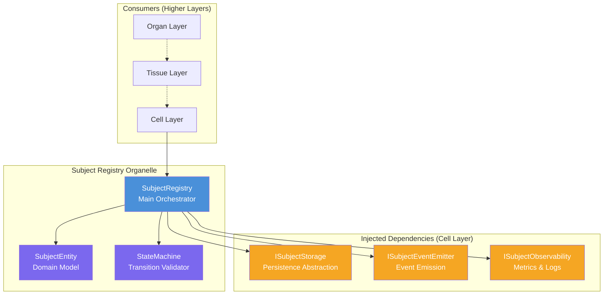
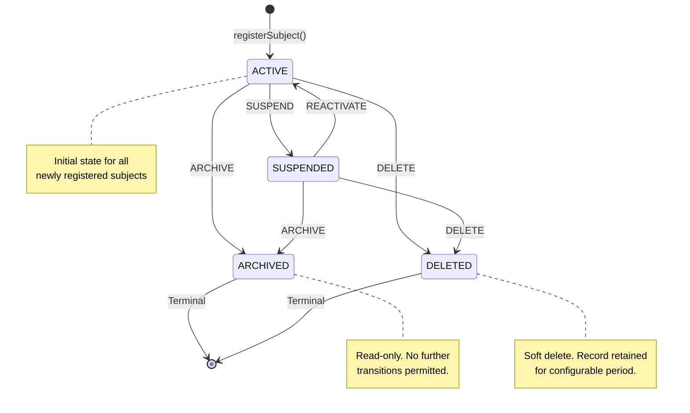
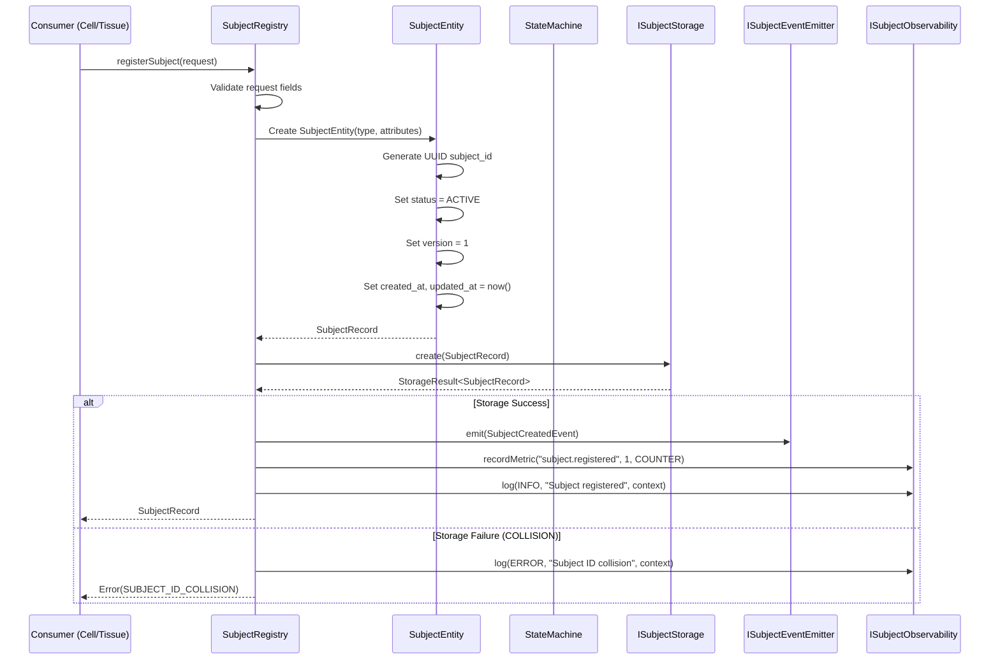
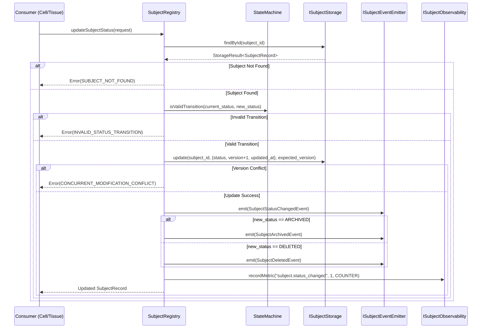
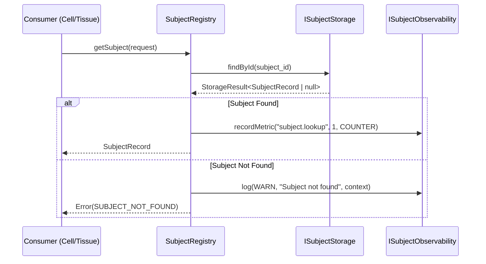
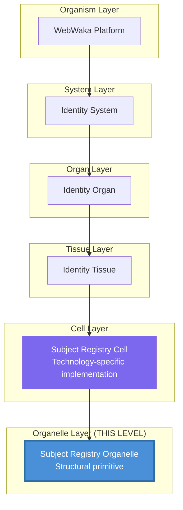
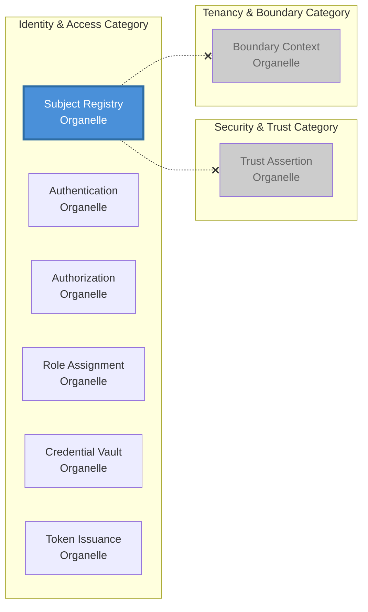

# [ORG-IA-SUBJECT_REGISTRY-v0.1.0-P1-T03] Create Architectural Diagrams

**Structure:** `ORG-IA-SUBJECT_REGISTRY-v0.1.0`
**Layer:** Organelle
**Category:** Identity & Access (01)
**Issue:** #9
**Parent Issue:** #6 (Phase 1: Design)
**Master Issue:** #1 (Subject Registry Organelle — Master Implementation Issue)
**Repository:** WebWakaHub/webwaka-organelle-universe
**Type:** design
**Execution Date:** 2026-02-26
**Executing Agent:** webwakaagent3 (Architecture & System Design Department)
**Acting Under Canonical Role:** Architecture & System Design
**Protocol:** WebWaka Autonomous Platform Construction System

---

## 1. Overview

This document provides the complete set of **architectural diagrams** for the Subject Registry Organelle. These diagrams visualize the organelle's internal structure, external interactions, data flow, and lifecycle behavior. All diagrams are expressed in Mermaid notation for version-control compatibility and reproducibility.

---

## 2. Component Architecture Diagram

This diagram shows the internal components of the Subject Registry Organelle and their relationships.

### 2.1. Component Descriptions

| Component | Responsibility | Internal/External |
|-----------|---------------|-------------------|
| **SubjectRegistry** | Main orchestrator — coordinates all operations, delegates to SubjectEntity and StateMachine | Internal |
| **SubjectEntity** | Domain model — enforces structural invariants on individual subject records | Internal |
| **StateMachine** | Transition validator — validates status transitions against the state machine rules | Internal |
| **ISubjectStorage** | Persistence abstraction — injected at Cell layer | External (injected) |
| **ISubjectEventEmitter** | Event emission — injected at Cell layer | External (injected) |
| **ISubjectObservability** | Metrics and logging — injected at Cell layer | External (injected) |

---

## 3. Subject Lifecycle State Machine Diagram

This diagram formalizes the state machine designed in P1-T01.

---

## 4. Data Flow Diagram — Registration

This diagram shows the complete data flow for the `registerSubject` operation.

---

## 5. Data Flow Diagram — Status Update

---

## 6. Data Flow Diagram — Subject Lookup

---

## 7. Layer Position Diagram

This diagram shows the Subject Registry Organelle's position within the WebWaka Biological Architecture.

---

## 8. Category Boundary Diagram

This diagram shows the Subject Registry Organelle's position within the Identity & Access category and its isolation from other categories.

The dashed lines with X marks indicate **prohibited dependencies** (CON-SR-001). The Subject Registry Organelle has no dependencies on any other organelle, including those within its own category (for v0.1.0).

---

## 9. Verification Gate Checklist

| Gate Criterion | Status |
|----------------|--------|
| Component architecture diagram provided | PASS |
| State machine diagram provided (Mermaid) | PASS |
| Registration data flow sequence diagram provided | PASS |
| Status update data flow sequence diagram provided | PASS |
| Lookup data flow sequence diagram provided | PASS |
| Layer position diagram provided | PASS |
| Category boundary diagram provided | PASS |
| All diagrams use version-control-compatible notation | PASS |

---

## 10. Constitutional Compliance Declaration

This artifact has been produced in full compliance with:

- **AGENT_EXECUTION_CONTEXT_MASTER_CONSTITUTION_v1.0.0** — All pre-execution checklist items verified
- **ORGANELLE_IMPLEMENTATION_STANDARD** — Phase 1, Task 03 requirements satisfied
- **DGM-01 / DEP-01** — Dependency #8 confirmed complete before execution

---

## 11. Execution Metadata

| Field | Value |
|-------|-------|
| **Issue Number** | #9 |
| **Repository** | WebWakaHub/webwaka-organelle-universe |
| **Agent** | webwakaagent3 |
| **Wave** | Wave 1 (Infrastructure Stabilization) |
| **Sequence Phase** | 1A |
| **Execution Status** | COMPLETE |
| **Unblocks** | #6 (Phase 1: Design parent issue) |

---

*This document was produced by webwakaagent3 (Architecture & System Design Department) under the WebWaka Autonomous Platform Construction System. It represents a substantive design deliverable, not a template artifact.*
